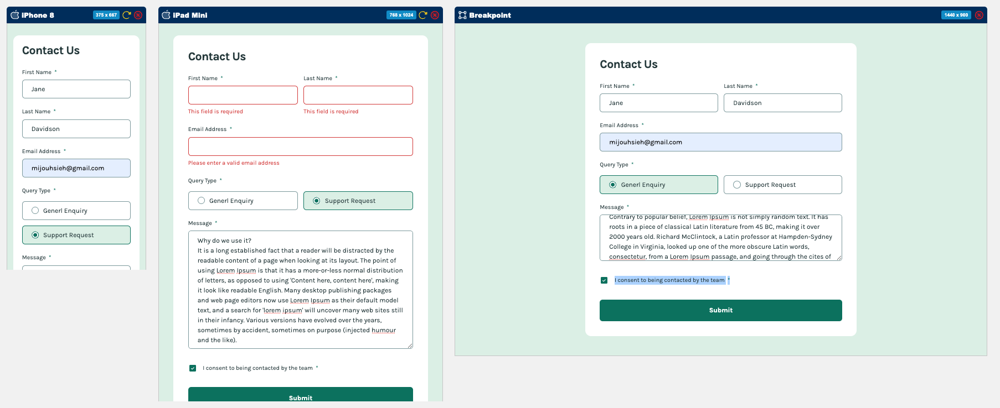

# Frontend Mentor - **Contact form**

Frontend Mentor 練習：**Contact form**。

本專案主要練習：切版 / RWD / React 元件拆分 / 表單驗證 / Formik + Yup / 客製化 radio 與 checkbox

---

## 目錄

* [Overview](#overview)

  * [專案目標](#專案目標)
  * [使用者可以做到的事](#使用者可以做到的事)
  * [截圖](#截圖)
  * [連結](#連結)
* [My process](#my-process)

  * [使用技術](#使用技術)
* [練習到的功能](#練習到的功能)

  * [表單欄位驗證](#表單欄位驗證)
  * [Formik 表單狀態管理](#formik-表單狀態管理)
  * [Yup validation schema](#yup-validation-schema)
  * [Query Type radio 選項](#query-type-radio-選項)
  * [客製化 checkbox](#客製化-checkbox)
  * [Textarea 訊息欄位](#textarea-訊息欄位)
  * [Submit success message](#submit-success-message)
* [元件設計](#元件設計)

  * [元件職責](#元件職責)
* [React 狀態設計](#react-狀態設計)
* [Tailwind CSS 練習重點](#tailwind-css-練習重點)
* [遇到的問題與解法](#遇到的問題與解法)

  * [named export 與絕對路徑匯入問題](#named-export-與絕對路徑匯入問題)
  * [`peer-checked` 沒有效果](#peer-checked-沒有效果)
  * [checkbox 勾選後 icon 沒有顯示](#checkbox-勾選後-icon-沒有顯示)
  * [加上 `checked` 後文字沒有變色](#加上-checked-後文字沒有變色)
  * [textarea 空白送出沒有顯示錯誤](#textarea-空白送出沒有顯示錯誤)
  * [radio button 如何做成互斥單選](#radio-button-如何做成互斥單選)
  * [Tailwind 的 `text-[32]` 是否有效](#tailwind-的-text32-是否有效)
* [未來可以改進的地方](#未來可以改進的地方)
* [Portfolio notes](#portfolio-notes)

  * [這個作品對應到真實產品中的哪些功能？](#這個作品對應到真實產品中的哪些功能)
* [如何在本機執行](#如何在本機執行)

  * [Clone 專案](#clone-專案)
  * [進入專案資料夾](#進入專案資料夾)
  * [安裝套件](#安裝套件)
  * [啟動開發伺服器](#啟動開發伺服器)

---

## Overview

### 專案目標

這個專案的目標是依照 Frontend Mentor 提供的設計稿，完成一個具有響應式版面、表單驗證與互動狀態的 Contact form。

本次練習重點包含：

* 依照設計稿完成 mobile / tablet / desktop 版面
* 使用 React 拆分表單元件
* 使用 Tailwind CSS 完成樣式與 RWD
* 使用 Formik 管理表單欄位狀態
* 使用 Yup 設計 validation schema
* 製作客製化 radio button 與 checkbox
* 顯示欄位錯誤訊息與送出成功訊息

---

### 使用者可以做到的事

使用者可以：

* 在不同螢幕尺寸下看到合適的表單版面
* 填寫 first name、last name、email、message
* 選擇 query type
* 勾選 consent checkbox
* 在必填欄位未填時看到錯誤訊息
* 在 email 格式錯誤時看到驗證提示
* hover / focus 表單元素時看到對應狀態
* 成功送出後看到 success message

---

### 截圖




---

### 連結

* Solution URL: TODO：[GitHub Repository](https://github.com/MiJouHsieh/Frontend-Mentor-Challenges/tree/main/08-contact-form)
* Live Site URL: [Live Demo](https://frontend-mentor-challenges-08-contact-form.vercel.app/)

---

## My process

### 使用技術

* React
* Vite
* JavaScript ES6+
* Tailwind CSS
* Formik
* Yup
* SVG as React Component
* HTML5 form
* Responsive Web Design
* Git / GitHub
* Vercel

---

## 練習到的功能

這次主要練習表單元件、驗證邏輯與互動狀態。

---

### 表單欄位驗證

表單欄位包含：

* First Name
* Last Name
* Email Address
* Query Type
* Message
* Consent checkbox

每個欄位都有對應的驗證規則，例如：

* 姓名必填
* Email 必填且格式需正確
* Query Type 必須選擇
* Message 必填
* Consent checkbox 必須勾選

---

### Formik 表單狀態管理

使用 Formik 管理表單資料、欄位 touched 狀態、錯誤訊息與送出流程。

Formik 的 `initialValues` 設定表單初始值：

```jsx
initialValues={{
  firstName: "",
  lastName: "",
  email: "",
  queryType: "",
  message: "",
  acceptedTerms: false,
}}
```

這次練習到：

* 如何用 Formik 管理 input 狀態
* 如何處理 checkbox 的 `checked`
* 如何處理 radio group 的 value
* 如何在送出後 reset form
* 如何根據 submit 狀態顯示成功訊息

---

### Yup validation schema

使用 Yup 建立表單驗證規則。

```jsx
const validationSchema = Yup.object({
  firstName: Yup.string().required("This field is required"),
  lastName: Yup.string().required("This field is required"),
  email: Yup.string()
    .email("Please enter a valid email address")
    .required("Please enter a valid email address"),
  queryType: Yup.string().required("Please select a query type"),
  message: Yup.string().required("This field is required"),
  acceptedTerms: Yup.boolean().oneOf(
    [true],
    "To submit this form, please consent to being contacted",
  ),
});
```

這裡學到的是：
`initialValues`、`validationSchema` 和實際欄位的 `name` 必須對得起來。

如果欄位有出現在畫面上，但沒有加進 `initialValues` 或 `validationSchema`，就可能出現「送出時沒有錯誤訊息」或「Formik 沒有管理到這個欄位」的問題。

---

### Query Type radio 選項

Query Type 使用 radio button，讓使用者只能選擇一個選項。

常見選項包含：

* General Enquiry
* Support Request

radio button 的重點是：

* 同一組 radio 的 `name` 要相同
* 每個選項要有不同的 `value`
* Formik 的 `values.queryType` 會記錄目前選到的 value
* 可以根據目前選中的 value 改變外框與背景色

範例概念：

```jsx
<label
  className={`flex cursor-pointer items-center rounded-lg border px-6 py-3 ${
    values.queryType === "general-enquiry"
      ? "border-green600 bg-green200"
      : "border-grey500"
  }`}
>
  <Field
    type="radio"
    name="queryType"
    value="general-enquiry"
  />
  <span>General Enquiry</span>
</label>
```

這次練習到 radio 的兩種寫法：

1. 用本地 `useState` 控制選取狀態
2. 改成與 Formik 連動，讓表單送出與驗證更一致

最後較適合表單專案的是 Formik 連動版本，因為 query type 本身就是表單資料的一部分。

---

### 客製化 checkbox

Consent checkbox 使用客製化樣式，讓預設 checkbox 隱藏，再用自訂外框和 SVG icon 呈現勾選狀態。

這次練習到：

* `input type="checkbox"` 如何與 Formik 連動
* `checked` 和 `value` 的差異
* 使用 `useField({ type: "checkbox" })` 取得 checkbox 需要的欄位狀態
* 使用 `peer` / `peer-checked` 控制兄弟元素樣式
* 勾選後顯示 SVG icon
* 勾選後改變文字或外框狀態

Formik checkbox 常見寫法：

```jsx
const [field, meta] = useField({
  name: "acceptedTerms",
  type: "checkbox",
});
```

`field` 會包含：

* `name`
* `checked`
* `onChange`
* `onBlur`

這樣 checkbox 就可以正確地跟 Formik 的表單狀態連動。

---

### Textarea 訊息欄位

Message 欄位使用 textarea，讓使用者輸入較長內容。

這次練習到：

* textarea 也可以用 Formik 管理
* textarea 的 `name` 要與 `initialValues.message` 對應
* textarea 的錯誤訊息要判斷 `meta.touched && meta.error`
* `rows` 可以控制預設顯示行數
* Tailwind 可以用 `min-h-*` 或 `h-*` 控制高度

常見概念：

```jsx
const [field, meta] = useField("message");

<textarea
  {...field}
  id="message"
  rows={4}
/>

{meta.touched && meta.error ? (
  <p>{meta.error}</p>
) : null}
```

---

### Submit success message

成功送出表單後，顯示成功訊息，讓使用者知道資料已送出。

這次練習到：

* 使用 submit 狀態控制 success message
* 表單送出後可以 `resetForm()`
* success message 可以獨立成元件，或先放在 `FormPage` 中管理

範例概念：

```jsx
onSubmit={(values, { resetForm }) => {
  setIsSubmitted(true);
  resetForm();
}}
```

---

## 元件設計

本專案目前可以拆分為：

```txt
src/
  assets/
    icon-checkbox-check.svg
    icon-radio-selected.svg
  components/
    FormPage.jsx
    FormInput.jsx
    QueryTypeSelect.jsx
    FormTextarea.jsx
    Checkbox.jsx
    SubmitButton.jsx
    index.js
  App.jsx
```

### 元件職責

| 元件                | 職責                                     |
| ----------------- | -------------------------------------- |
| `App`             | 頁面最外層容器，控制整體寬度、背景與間距                   |
| `FormPage`        | 表單主容器，組合所有欄位與 Formik 設定                |
| `FormInput`       | 共用文字輸入欄位，例如 first name、last name、email |
| `QueryTypeSelect` | query type radio group                 |
| `FormTextarea`    | message textarea 欄位                    |
| `Checkbox`        | consent checkbox                       |
| `SubmitButton`    | 表單送出按鈕                                 |

---

## React 狀態設計

這個專案主要由 Formik 管理表單狀態。

Formik 管理：

```jsx
values
errors
touched
handleChange
handleBlur
handleSubmit
```

表單中每個欄位都透過 `name` 對應到 Formik 的資料：

```jsx
firstName
lastName
email
queryType
message
acceptedTerms
```

這次學到的是：
表單資料、驗證規則和元件欄位名稱要保持一致。

例如：

```jsx
initialValues.message
validationSchema.message
<textarea name="message" />
```

這三個地方都要是 `message`，Formik 才能正確管理 textarea 的 value、error 和 touched 狀態。

---

## Tailwind CSS 練習重點

這次練習到：

* mobile-first RWD 寫法
* `flex` 與 `grid` 表單排版
* `gap` 控制欄位間距
* `rounded-*` 製作表單卡片圓角
* `border` / `outline` / `focus` 狀態
* `hover` 狀態
* `min-w-[375px]` 控制最小版面寬度
* `px-4 py-8` 控制 mobile 外距
* `md:*` 調整 tablet / desktop 版面
* `peer` / `peer-checked` 控制自訂 radio 與 checkbox 樣式
* `hidden` 搭配自訂 UI 隱藏原生 input
* SVG 透過 `vite-plugin-svgr` 當成 React Component 使用
* Tailwind arbitrary value，例如 `text-[32px]`

---

## 遇到的問題與解法

### named export 與絕對路徑匯入問題

**問題：**

每個元件都使用 named export，但想要在 `FormPage` 一次從 `"src/components"` 匯入多個元件。

例如：

```jsx
import { FormInput, Checkbox, SubmitButton } from "src/components";
```

**原因：**

如果要從 `"src/components"` 匯入，資料夾內需要有 `index.js` 或 `index.jsx` 統一轉出元件。

否則只能直接從檔案路徑匯入：

```jsx
import { FormPage } from "src/components/FormPage";
```

**解法：**

在 `src/components/index.js` 中加入：

```jsx
export { FormInput } from "./FormInput";
export { QueryTypeSelect } from "./QueryTypeSelect";
export { FormTextarea } from "./FormTextarea";
export { Checkbox } from "./Checkbox";
export { SubmitButton } from "./SubmitButton";
export { FormPage } from "./FormPage";
```

之後就可以：

```jsx
import {
  FormInput,
  QueryTypeSelect,
  FormTextarea,
  Checkbox,
  SubmitButton,
} from "src/components";
```

如果要使用 `src/...` 這種絕對路徑，Vite 也需要設定 alias，或確認專案已經能解析 `src`。

---

### `peer-checked` 沒有效果

**問題：**

想用 Tailwind 的 `peer-checked` 讓 checkbox 或 radio 勾選後改變其他元素樣式，但畫面沒有反應。

**原因：**

`peer-checked` 只能影響「在 peer 後面的兄弟元素」。

也就是說，這種結構才會有效：

```jsx
<input type="checkbox" className="peer hidden" />
<span className="peer-checked:text-red-500">
  I consent to being contacted
</span>
```

如果要被控制的元素在 input 前面，或不是同層兄弟元素，`peer-checked` 就不會生效。

**解法：**

調整 JSX 結構，讓被控制的元素放在 `input.peer` 後面。

---

### checkbox 勾選後 icon 沒有顯示

**問題：**

使用 SVG icon 做自訂 checkbox，但勾選後 icon 沒有顯示。

**原因：**

常見原因有幾個：

* SVG icon 不在 `input.peer` 後面
* `peer-checked:block` 套用的元素不是 input 的兄弟元素
* icon 被其他元素蓋住
* input 被完全隱藏後，label 點擊區域沒有正確包住 input
* Formik checkbox 沒有正確綁定 `checked`

**解法：**

可以讓 input 隱藏，並用 label 包住整個可點擊區域：

```jsx
<label className="flex cursor-pointer items-center">
  <input
    type="checkbox"
    name="acceptedTerms"
    className="peer hidden"
  />

  <span className="flex h-[18px] w-[18px] items-center justify-center rounded-sm border-2 border-grey500">
    <IconCheckboxCheck className="hidden peer-checked:block" />
  </span>

  <span>I consent to being contacted by the team</span>
</label>
```

不過要注意：
上面這種寫法中，`peer-checked:block` 不能直接作用在 span 裡更深層的 icon，因為 Tailwind peer 預設是控制後方兄弟元素。實作時可以把 icon 和 box 結構調整成同層，或改用 Formik 的 `checked` 狀態條件渲染 icon。

更穩定的 React 寫法是：

```jsx
{field.checked && <IconCheckboxCheck />}
```

---

### 加上 `checked` 後文字沒有變色

**問題：**

在 checkbox input 加上：

```jsx
checked
```

但 `peer-checked:text-red-500` 沒有效果。

**原因：**

在 React 中，只寫 `checked` 代表這個 checkbox 永遠是 checked，會變成受控元件，但沒有 `onChange` 的話狀態不會正常切換。

而且如果文字不是 input 的後方兄弟元素，`peer-checked` 仍然不會有效。

**解法：**

不要只寫死 `checked`，應該交給 state 或 Formik 控制。

Formik 寫法：

```jsx
<input
  type="checkbox"
  {...field}
  className="peer hidden"
/>
```

或用 React state：

```jsx
<input
  type="checkbox"
  checked={isChecked}
  onChange={(event) => setIsChecked(event.target.checked)}
/>
```

---

### textarea 空白送出沒有顯示錯誤

**問題：**

Message textarea 空白 submit 時沒有顯示錯誤訊息。

**原因：**

常見原因是 `message` 沒有加進 Formik 的 `initialValues` 或 Yup 的 `validationSchema`。

**解法：**

Formik 初始值要有：

```jsx
initialValues={{
  message: "",
}}
```

Yup 驗證也要有：

```jsx
message: Yup.string().required("This field is required"),
```

`FormTextarea` 中也要判斷：

```jsx
{meta.touched && meta.error ? (
  <p>{meta.error}</p>
) : null}
```

---

### radio button 如何做成互斥單選

**問題：**

Query Type 有兩個 radio 選項，希望一次只能選一個。

**原因：**

radio 是否屬於同一組，是看 `name` 是否相同。

**解法：**

同一組 radio 使用相同的 `name`，不同選項使用不同 `value`：

```jsx
<input
  type="radio"
  name="queryType"
  value="general-enquiry"
/>

<input
  type="radio"
  name="queryType"
  value="support-request"
/>
```

在 Formik 中，兩個 radio 都對應同一個欄位：

```jsx
name="queryType"
```

Formik 會把目前選到的 value 存到：

```jsx
values.queryType
```

---

### Tailwind 的 `text-[32]` 是否有效

**問題：**

想用 Tailwind 設定 32px 字級，寫成：

```html
text-[32]
```

**原因：**

Tailwind arbitrary value 需要寫單位。

**解法：**

應該寫成：

```html
text-[32px]
```

如果是 line-height，也可以寫：

```html
leading-[150%]
```

或：

```html
leading-[1.5]
```

---

## 未來可以改進的地方

之後可以補強：

* 加入更完整的 accessibility，例如 `aria-invalid`、`aria-describedby`
* 表單送出成功訊息可以加上動畫
* 錯誤訊息可以抽成共用元件
* Query Type radio 可以整理成資料陣列，用 `map()` 渲染
* checkbox 與 radio 可以抽成更通用的共用元件
* 加入測試，確認 validation schema 正確
* 改用 TypeScript 定義表單資料型別
* 串接真實 API，補上 loading / error / success 狀態
* submit 後可以模擬後端回應
* 優化鍵盤操作與 focus 樣式

---

## Portfolio notes

這個作品可以放在作品牆中，定位為：

> 一個練習表單驗證、React 表單狀態管理、客製化 input UI 與 RWD 切版的前端小作品。

### 這個作品對應到真實產品中的哪些功能？

類似功能常見於：

* 官網 Contact Us 表單
* SaaS 產品詢問表單
* 客服支援表單
* 報名表單
* 註冊流程中的同意條款
* 後台資料新增 / 編輯表單
* 問卷或回饋表單
* CRM 潛在客戶資料收集表單

---

## 如何在本機執行

### Clone 專案

```bash
git clone https://github.com/MiJouHsieh/Frontend-Mentor-Challenges.git
```

### 進入專案資料夾

```bash
cd Frontend-Mentor-Challenges/08-contact-form
```

### 安裝套件

```bash
npm install
```

### 啟動開發伺服器

```bash
npm run dev
```

---
