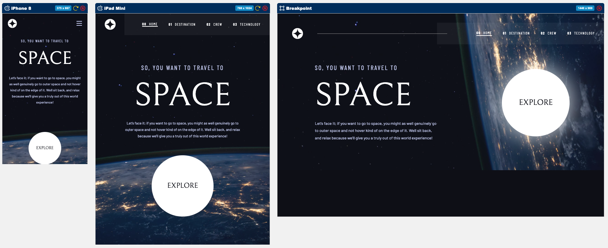

# Frontend Mentor - **Space tourism multi-page website**

Frontend Mentor 練習：**Space tourism multi-page website**。

本專案主要練習：切版 / RWD / React Router 多頁路由 / 動態資料渲染 / Tailwind CSS / 響應式圖片與背景切換

---

## 目錄

- Overview
    - 專案目標
    - 使用者可以做到的事
    - 截圖
    - 連結
- My process
    - 使用技術
- 練習到的功能
    - 多頁面路由
    - 使用 useParams 動態切換內容
    - 使用 useState 控制 UI 切換
    - RWD 背景圖片切換
    - 共用元件設計
- 元件設計
    - 元件職責
- React 狀態設計
- Tailwind CSS 練習重點
- 遇到的問題與解法
    - 不同頁面背景圖片如何切換
    - Nav 要放在 App 還是每個頁面中
    - 使用 useParams 切換 Destination / Crew 內容
    - useState 控制 Technology 頁面切換
    - 自訂 1440px breakpoint
    - 圖片被固定寬高拉變形
    - h-full 沒有效果
    - 半透明 border 但文字不透明
    - 設計稿 letter spacing 百分比如何換算
- 未來可以改進的地方
- Portfolio notes
    - 這個作品對應到真實產品中的哪些功能？
- 如何在本機執行
    - Clone 專案
    - 進入專案資料夾
    - 安裝套件
    - 啟動開發伺服器

---

## Overview

### 專案目標

這個專案的目標是依照 Frontend Mentor 提供的設計稿，完成一個具有多頁面切換、響應式版面與互動狀態的太空旅遊介紹網站。

本次練習重點包含：

- 依照設計稿完成 mobile / tablet / desktop 版面
- 使用 React 拆分頁面與共用元件
- 使用 React Router 建立多頁面路由
- 使用 `useParams` 依照 URL 參數動態切換頁面資料
- 使用 `useState` 控制 Technology 頁面的內容切換
- 使用 Tailwind CSS 完成 RWD、背景圖片切換與細節樣式
- 練習圖片比例、背景圖、定位、文字樣式與互動狀態

---

### 使用者可以做到的事

使用者可以：

- 在不同螢幕尺寸下看到符合設計稿的版面
- 使用導覽列切換 Home / Destination / Crew / Technology 頁面
- 在 Destination 頁面切換不同星球內容
- 在 Crew 頁面切換不同成員內容
- 在 Technology 頁面切換不同科技項目
- hover 或點擊導覽列、分頁按鈕時看到對應狀態
- 在 mobile / tablet / desktop 下看到不同尺寸與構圖的背景圖片

---

### 截圖



---

### 連結

- Solution URL: [GitHub Repository](https://github.com/MiJouHsieh/Frontend-Mentor-Challenges/tree/main/09-space-tourism-multi-page-website)
- Live Site URL: [Live Demo](https://09-space-tourism-multi-page-website.vercel.app/)

---

## My process

### 使用技術

- React
- Vite
- JavaScript ES6+
- React Router DOM
- Tailwind CSS
- HTML5 / CSS3
- Responsive Web Design
- Git / GitHub
- Vercel

---

## 練習到的功能

這次主要練習：

### 多頁面路由

使用 `react-router-dom` 建立多頁面切換。

```jsx
import {
  BrowserRouter as Router,
  Routes,
  Route,
  Navigate,
} from "react-router-dom";

export function App() {
  return (
    <Router>
      <Nav />

      <Routes>
        <Route path="/" element={<HomePage />} />

        <Route
          path="/destination"
          element={<Navigate to="/destination/moon" />}
        />
        <Route
          path="/destination/:planet"
          element={<DestinationPage />}
        />

        <Route
          path="/crew"
          element={<Navigate to="/crew/commander" />}
        />
        <Route
          path="/crew/:position"
          element={<CrewPage />}
        />

        <Route path="/technology" element={<TechnologyPage />} />
      </Routes>
    </Router>
  );
}
```

練習重點：

- 如何設定多頁面路由
- 如何使用 `Navigate` 做預設頁面導向
- 如何讓頁面透過 URL 參數決定顯示內容
- 如何讓 `Nav` 成為整個網站共用的導覽元件

---

### 使用 `useParams` 動態切換內容

Destination 和 Crew 頁面使用 `useParams()` 取得網址中的參數，再從資料物件中找到對應內容。

例如 Destination：

```jsx
const { planet } = useParams();
const data = DESTINATION_LIST[planet] || DESTINATION_LIST["moon"];
```

這樣當網址是：

```
/destination/moon
/destination/mars
/destination/europa
/destination/titan
```

畫面就會根據 `planet` 參數顯示不同星球資料。

練習重點：

- URL 可以成為畫面狀態的一部分
- 使用 `Link` 切換網址與內容
- 使用 fallback 避免網址錯誤時畫面壞掉
- 將資料集中放在 constants，讓頁面元件不用寫太多重複 JSX

---

### 使用 `useState` 控制 UI 切換

Technology 頁面使用 `useState` 控制目前選取的 technology。

```jsx
const [selectedTech, setSelectedTech] = useState("launch-vehicle");
```

預設值設定為 `"launch-vehicle"`，所以使用者進入 Technology 頁面時會先看到 Launch Vehicle。

```jsx
{selectedTech === "launch-vehicle" && <LaunchVehicle />}
{selectedTech === "spaceport" && <Spaceport />}
{selectedTech === "capsule" && <Capsule />}
```

練習重點：

- `useState` 適合處理不一定要反映在網址上的 UI 狀態
- 如果多個元件都需要讀取或修改同一個狀態，可以把狀態放到共同父層
- Paginator 可以放在子元件裡維持排版，但狀態仍可以由父層傳入

---

### RWD 背景圖片切換

每個頁面都有 mobile / tablet / desktop 不同背景圖。

使用 Tailwind responsive class 切換背景圖片：

```jsx
<div className="absolute left-0 top-0 -z-10 h-full w-full bg-[url('/src/assets/destination/background-destination-mobile.jpg')] bg-cover bg-center md:bg-[url('/src/assets/destination/background-destination-tablet.jpg')] 1440:bg-[url('/src/assets/destination/background-destination-desktop.jpg')]" />
```

練習重點：

- Tailwind 是 mobile-first
- 預設寫 mobile 樣式
- `md:` 從 768px 以上套用
- 自訂 `1440:` 從 1440px 以上套用
- 背景圖適合用在整頁視覺背景
- 內容圖片則較適合使用 `` 或 `<picture>`

---

### 共用元件設計

本專案有多個頁面會共用相似元素，例如：

- `Nav`
- 頁面標題
- 分頁按鈕 / Paginator
- 背景設定
- 資料切換列表

透過拆分元件，可以減少重複程式碼，讓頁面邏輯更清楚。

---

## 元件設計

本專案可以整理為：

```
src/
  assets/
    home/
    destination/
    crew/
    technology/

  components/
    Nav.jsx
    PageTitle.jsx
    Paginator.jsx

  pages/
    HomePage.jsx
    DestinationPage.jsx
    CrewPage.jsx
    TechnologyPage.jsx

  components/technology/
    LaunchVehicle.jsx
    Spaceport.jsx
    Capsule.jsx

  constants/
    index.js

  App.jsx
```

### 元件職責

| 元件 | 職責 |
| --- | --- |
| `Nav` | 網站主要導覽列，負責頁面切換 |
| `PageTitle` | 顯示各頁共用標題，例如 `01 Pick your destination` |
| `DestinationPage` | 根據 URL 參數顯示不同星球資料 |
| `CrewPage` | 根據 URL 參數顯示不同成員資料 |
| `TechnologyPage` | 控制目前選取的 technology 狀態 |
| `Paginator` | 顯示分頁 / 切換按鈕 |
| `LaunchVehicle` | 顯示 Launch Vehicle 內容 |
| `Spaceport` | 顯示 Spaceport 內容 |
| `Capsule` | 顯示 Space Capsule 內容 |

---

## React 狀態設計

本專案使用兩種主要的畫面狀態管理方式：

### 1. URL-driven state

Destination / Crew 頁面使用 `useParams()`。

適合用在：

- 使用者可以直接複製網址
- 重新整理後仍停留在同一個內容
- 每個內容本身像是一個獨立頁面

例如：

```jsx
const { planet } = useParams();
const data = DESTINATION_LIST[planet] || DESTINATION_LIST["moon"];
```

---

### 2. UI state

Technology 頁面使用 `useState()`。

適合用在：

- 單純頁面內部切換
- 不一定需要反映在網址上
- 切換內容比較像 tab / carousel / paginator

例如：

```jsx
const [selectedTech, setSelectedTech] = useState("launch-vehicle");
```

---

## Tailwind CSS 練習重點

這次練習到：

- mobile-first RWD 寫法
- 自訂 `1440px` breakpoint
- `flex` / `grid` 排版
- `absolute` 背景定位
- `bg-cover` / `bg-center` / `bg-no-repeat`
- 不同斷點切換背景圖片
- `max-w`、`min-w`、`flex-1` 的使用
- `h-full` 與父層高度的關係
- `object-contain` / `object-cover` 避免圖片變形
- `opacity` 對子元素的影響
- `outline` / `border` 半透明效果
- `tracking-[0.15em]` 對應設計稿 letter spacing
- `leading-[180%]` 對應設計稿 line-height 百分比
- hover / active 狀態
- 使用 `map()` 渲染導覽項目與分頁項目

---

## 遇到的問題與解法

### 不同頁面背景圖片如何切換

**問題：**

Home / Destination / Crew / Technology 每個頁面都有不同背景圖，而且 mobile / tablet / desktop 圖片也不同。

**解法：**

可以把背景圖放在各頁面元件中，讓每個頁面自己負責自己的背景。

```jsx
<section className="relative min-h-screen w-full">
  <div className="absolute left-0 top-0 -z-10 h-full w-full bg-[url('/src/assets/home/background-home-mobile.jpg')] bg-cover bg-center md:bg-[url('/src/assets/home/background-home-tablet.jpg')] 1440:bg-[url('/src/assets/home/background-home-desktop.jpg')]" />

  {/* page content */}
</section>
```

**學到的事：**

如果背景是每一頁都不同，通常不適合放在 `App.jsx` 最外層統一管理。

讓每個 page 自己處理背景，會比較直覺，也比較好維護。

---

### Nav 要放在 App 還是每個頁面中

**問題：**

不同頁面有不同背景，那 `Nav` 要放在 `App.jsx` 共用，還是每個頁面都放一次？

**解法：**

`Nav` 是全站共用導覽，適合放在 `App.jsx` 的 `Routes` 外面。

```jsx
<Router>
  <Nav />
  <Routes>
    <Route path="/" element={<HomePage />} />
    <Route path="/destination/:planet" element={<DestinationPage />} />
    <Route path="/crew/:position" element={<CrewPage />} />
    <Route path="/technology" element={<TechnologyPage />} />
  </Routes>
</Router>
```

背景則放在每個 page 裡。

**學到的事：**

- 全站共用的東西放外層，例如 `Nav`
- 每頁不同的視覺背景放 page 裡
- 這樣可以避免每個頁面重複寫 `Nav`

---

### 使用 `useParams` 切換 Destination / Crew 內容

**問題：**

Destination 和 Crew 都有多筆資料，需要根據點擊項目切換內容。

**解法：**

使用 React Router 的動態路由。

```jsx
<Route path="/destination/:planet" element={<DestinationPage />} />
```

在頁面中取得參數：

```jsx
const { planet } = useParams();
const data = DESTINATION_LIST[planet] || DESTINATION_LIST["moon"];
```

使用 `Link` 切換網址：

```jsx
<Link to="/destination/mars">Mars</Link>
```

**學到的事：**

`useParams` 很適合用在「網址就是狀態」的情境。

例如 `/destination/mars` 本身就代表目前畫面應該顯示 Mars。

---

### `useState` 控制 Technology 頁面切換

**問題：**

Technology 頁面只是在同一頁中切換三個內容，不確定要不要也使用路由。

**解法：**

可以使用 `useState`。

```jsx
const [selectedTech, setSelectedTech] = useState("launch-vehicle");
```

如果只是頁面內部 tab 切換，`useState` 就很適合。

**學到的事：**

- 想讓網址也變化：用 React Router / `useParams`
- 只是頁面內部切換：用 `useState`
- 預設畫面可以直接放在 `useState` 初始值

---

### 自訂 `1440px` breakpoint

**問題：**

設計稿有 desktop 1440px，但 Tailwind 預設沒有 `1440:` 這個 class。

**解法：**

在 `tailwind.config.js` 加上自訂 breakpoint：

```jsx
export default {
  theme: {
    extend: {
      screens: {
        "1440": "1440px",
      },
    },
  },
};
```

之後就可以使用：

```html
<div className="md:px-10 1440:px-0">
```

**學到的事：**

Tailwind 可以自訂斷點名稱。

但名稱如果是數字，class 會長得像 `1440:`，可讀性可以接受，也可以改成 `desktop:`。

---

### 圖片被固定寬高拉變形

**問題：**

圖片設定固定 `width` 和 `height` 後，看起來比例被拉壞。

```jsx

```

**原因：**

如果同時指定寬高，但比例和原圖不同，圖片就會被拉伸。

**解法：**

使用 `object-contain` 或 `object-cover`。

```jsx

```

或只固定其中一個方向：

```jsx

```

**學到的事：**

- `object-contain`：完整顯示圖片，不裁切
- `object-cover`：填滿容器，可能裁切
- `w-auto` / `h-auto` 可以保留原圖比例

---

### `h-full` 沒有效果

**問題：**

設定 `h-full`，但元素沒有撐滿高度。

**原因：**

`h-full` 是「吃父層高度」。

如果父層沒有明確高度，子層的 `h-full` 就不知道要撐到多高。

**解法：**

讓父層有明確高度，或改用內容撐開：

```html
<section className="min-h-screen">
```

或在需要時設定父層高度：

```html
<div className="h-screen">
  <div className="h-full"></div>
</div>
```

**學到的事：**

`h-full` 不是自己產生高度，而是依賴父層高度。

---

### 半透明 border 但文字不透明

**問題：**

Paginator 的外框要半透明，但裡面的數字要保持不透明。

如果直接在 `li` 設定 `opacity-25`，裡面的文字也會一起變透明。

**錯誤做法：**

```jsx
<li className="opacity-25 outline outline-white">
  <span>1</span>
</li>
```

**原因：**

`opacity` 會影響整個元素和所有子元素。

**解法：**

不要用 `opacity` 控制整個 `li`，改用半透明顏色。

```jsx
<li className="border border-white/25 text-white">
  1
</li>
```

或 Tailwind outline：

```jsx
<li className="outline outline-1 outline-white/25 text-white">
  1
</li>
```

**學到的事：**

想讓 border 半透明時，使用 `border-white/25`，不要使用 `opacity-25`。

---

### 設計稿 letter spacing 百分比如何換算

**問題：**

設計稿給 letter spacing `15%`，不知道 Tailwind 要怎麼寫。

**解法：**

CSS 的 `letter-spacing` 不能直接寫百分比。

通常可以換算成 `em`：

```
15% = 0.15em
```

Tailwind 可以寫：

```html
<p className="tracking-[0.15em]">
```

**學到的事：**

設計稿 letter spacing 如果是百分比，可以大致換成：

```
百分比 / 100 = em
```

例如：

```
4%  -> 0.04em
15% -> 0.15em
```

---

## 未來可以改進的地方

之後可以補強：

- 使用 `NavLink` 處理目前頁面的 active 狀態
- 將 Destination / Crew / Technology 都改成更一致的資料驅動結構
- 將背景設定抽成共用設定或 layout component
- 將 Paginator 做成更通用的元件
- 補上 keyboard focus 狀態
- 補上 `aria-current`、`aria-label` 等 accessibility 細節
- 使用 TypeScript 定義資料型別
- 補上頁面轉場動畫
- 補上 loading / error / fallback page
- 補上 404 頁面
- 優化圖片載入，例如 `<picture>`、`srcSet`、lazy loading
- 清除開發用 `outline` class
- 整理 README 截圖與作品說明，讓它更適合放進作品牆

---

## Portfolio notes

這個作品可以放在作品牆中，定位為：

> 一個練習多頁面路由、RWD 切版、動態資料渲染與 Tailwind CSS 細節控制的前端作品。
> 

### 這個作品對應到真實產品中的哪些功能？

類似功能常見於：

- 品牌形象網站
- 旅遊目的地介紹頁
- SaaS 官網多頁 landing page
- 產品介紹網站
- 活動網站
- 內容型網站的分類頁面
- 團隊成員介紹頁
- 商品 / 服務特色介紹頁

這個專案雖然是靜態內容，但練習到的技術可以對應到真實產品中的：

- 多頁路由
- 導覽列設計
- RWD 版面
- 資料驅動畫面
- tab / paginator 切換
- 圖片與背景管理
- 設計稿還原能力

---

## 如何在本機執行

### Clone 專案

```bash
git clone https://github.com/MiJouHsieh/Frontend-Mentor-Challenges.git
```

### 進入專案資料夾

```bash
cd Frontend-Mentor-Challenges/9-space-tourism-multi-page
```

### 安裝套件

```bash
npm install
```

### 啟動開發伺服器

```bash
npm run dev
```

---