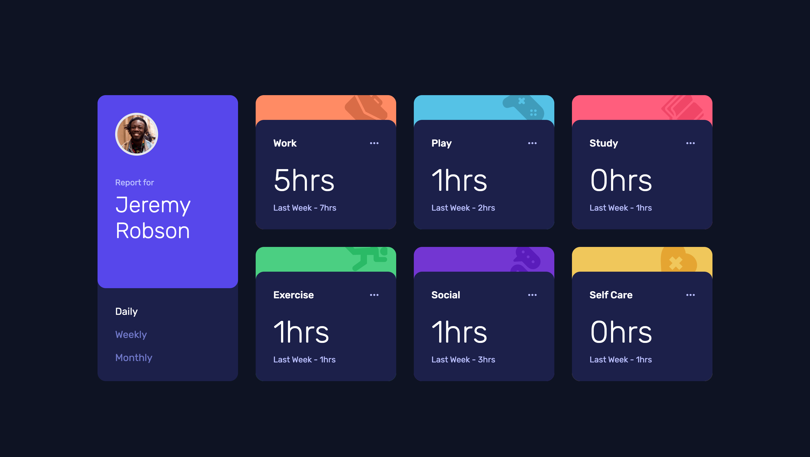
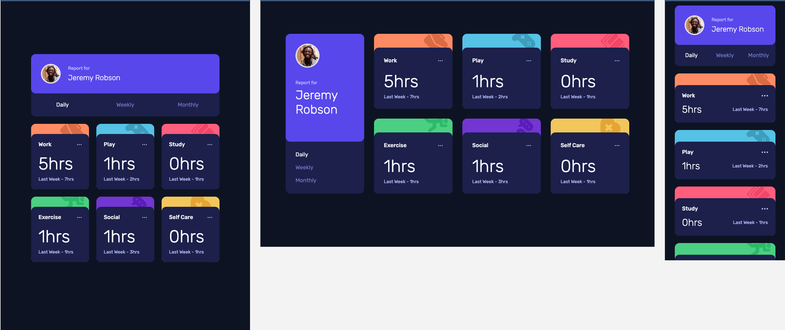

# Time Tracking Dashboard

A responsive time tracking dashboard built with React, Vite, and Tailwind CSS.

## Features

- Switch between daily, weekly, and monthly time ranges
- Render activity cards from local JSON data
- Responsive layout for mobile, tablet, and desktop
- Hover states for interactive elements

## Built with

- React
- Vite
- Tailwind CSS
- JavaScript
- Local JSON data

## What I practiced

- Component-based UI structure
- Mobile-first responsive layout
- Mapping JSON data into reusable cards
- Managing active tab state with React `useState`
- Adjusting SVG icon sizing and responsive spacing

## Links

- Live Site URL: https://13-time-tracking-dashboard.vercel.app/
- GitHub Repo: https://github.com/MiJouHsieh/Frontend-Mentor-Challenges/tree/main/13-time-tracking-dashboard

## Screenshot

