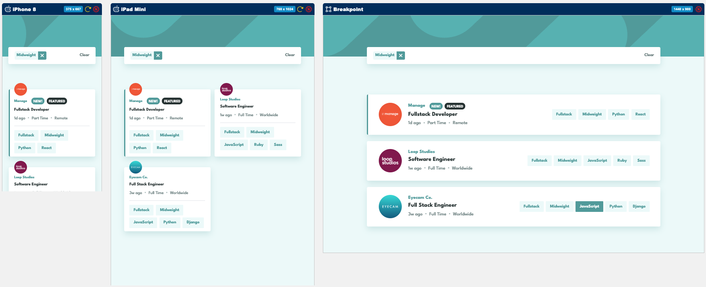

# Frontend Mentor - **Job listings with filtering**

Frontend Mentor 練習：**Job listings with filtering**。

本專案主要練習：切版 / RWD / React 狀態管理 / 多條件篩選 / localStorage 狀態保存

---

## 目錄

- [Overview](#overview)
  - [專案目標](#專案目標)
  - [使用者可以做到的事](#使用者可以做到的事)
  - [截圖](#截圖)
  - [連結](#連結)
- [My process](#my-process)
  - [使用技術](#使用技術)
- [練習到的功能](#練習到的功能)
  - [資料渲染](#資料渲染)
  - [Tag 篩選功能](#tag-篩選功能)
  - [Filter Bar 狀態同步](#filter-bar-狀態同步)
  - [localStorage 狀態保存](#localstorage-狀態保存)
- [元件設計](#元件設計)
  - [元件職責](#元件職責)
- [React 狀態設計](#react-狀態設計)
- [Tailwind CSS 練習重點](#tailwind-css-練習重點)
- [遇到的問題與解法](#遇到的問題與解法)
  - [`h-screen` 讓背景高度不夠](#h-screen-讓背景高度不夠)
  - [tag 文字視覺上沒有垂直置中](#tag-文字視覺上沒有垂直置中)
  - [Filter tag 的圓角沒有正常顯示](#filter-tag-的圓角沒有正常顯示)
  - [選多個 tag 時的篩選邏輯](#選多個-tag-時的篩選邏輯)
- [未來可以改進的地方](#未來可以改進的地方)
- [Portfolio notes](#portfolio-notes)
  - [這個作品對應到真實產品中的哪些功能？](#這個作品對應到真實產品中的哪些功能)
  - [可以延伸成共用元件嗎？](#可以延伸成共用元件嗎)
  - [面試時可以說明的重點](#面試時可以說明的重點)
- [如何在本機執行](#如何在本機執行)
  - [Clone 專案](#clone-專案)
  - [進入專案資料夾](#進入專案資料夾)
  - [安裝套件](#安裝套件)
  - [啟動開發伺服器](#啟動開發伺服器)
- [Author](#author)

---

## Overview

### 專案目標

這個專案的目標是依照 Frontend Mentor 提供的設計稿，完成一個具有響應式版面與互動功能的前端頁面。

本次練習重點包含：

- 依照設計稿完成 mobile / tablet / desktop 版面
- 使用 React 拆分元件
- 使用 Tailwind CSS 完成樣式與 RWD
- 使用狀態管理處理使用者互動
- 讓畫面資料可以依照使用者操作即時更新

---

### 使用者可以做到的事

使用者可以：

- 在不同螢幕尺寸下看到合適的版面
- hover 互動元素時看到對應狀態
- 點擊職缺卡片上的 tag 進行多條件篩選
- 在 filter bar 看到目前選取的篩選條件
- 移除單一篩選條件
- 清除全部篩選條件
- 重新整理頁面後保留目前篩選條件（有使用 localStorage）

---

### 截圖



---

### 連結

- Solution URL: [GitHub Repository](連結)
- Live Site URL: [Live Demo](連結)

---

## My process

### 使用技術

- React
- Vite
- JavaScript ES6+
- Tailwind CSS
- HTML5 / CSS3
- Responsive Web Design
- localStorage
- Git / GitHub
- Vercel

---

## 練習到的功能

這次主要練習：

### 資料渲染

使用 `map()` 將 `data.json` 裡的職缺資料渲染成多張 JobCard。

練習重點：

- 如何設計資料傳遞
- 如何用 props 將資料傳進元件
- 如何避免在 JSX 中塞太多重複結構

---

### Tag 篩選功能

使用者點擊職缺卡片上的 tag 後，會將該 tag 加入 `selectedFilters`。

篩選邏輯是：

- 如果目前沒有選擇任何 tag，顯示全部職缺
- 如果有選擇 tag，只顯示符合所有篩選條件的職缺
- 如果使用者重複點擊同一個 tag，不重複加入

```jsx
const handleFilterClick = (tag) => {
  setSelectedFilters((prevFilters) => {
    if (prevFilters.includes(tag)) {
      return prevFilters;
    }

    return [...prevFilters, tag];
  });
};
```

---

### Filter Bar 狀態同步

當 `selectedFilters` 有內容時，顯示 FilterBar。

使用者可以：

- 移除單一 tag
- 清除全部 tag
- 讓職缺列表即時更新

---

### localStorage 狀態保存

本專案加入 localStorage，讓使用者重新整理頁面後，仍可以保留目前選取的篩選條件。

```jsx
const [selectedFilters, setSelectedFilters] = useState(() => {
  const storedTags = localStorage.getItem("selectedFilters");
  return storedTags ? JSON.parse(storedTags) : [];
});

useEffect(() => {
  localStorage.setItem("selectedFilters", JSON.stringify(selectedFilters));
}, [selectedFilters]);
```

---

## 元件設計

本專案目前拆分為：

```txt
src/
  components/
    layout/
      Header.jsx
    filters/
      FilterBar.jsx
      SelectedFilterTag.jsx
    jobs/
      JobListSection.jsx
      JobList.jsx
      JobCard.jsx
      JobTag.jsx
  data/
    data.json
  App.jsx
```

### 元件職責

| 元件 | 職責 |
| --- | --- |
| `Header` | 頁面頂部視覺區塊 |
| `JobListSection` | 職缺列表區塊容器 |
| `JobList` | 負責渲染職缺列表 |
| `JobCard` | 顯示單一職缺內容 |
| `JobTag` | 職缺卡片中的可點擊篩選標籤 |
| `FilterBar` | 顯示目前已選取的篩選條件 |
| `SelectedFilterTag` | FilterBar 中的單一篩選標籤與 remove button |

---

## React 狀態設計

本專案主要狀態是：

```jsx
const [selectedFilters, setSelectedFilters] = useState([]);
```

我將 `selectedFilters` 放在 `App.jsx`，因為：

- `JobTag` 點擊時需要新增篩選條件
- `FilterBar` 需要讀取目前選取的條件
- `JobListSection` 需要根據條件顯示篩選後的資料

這是一個典型的「狀態提升」練習，因為多個元件都需要共享同一份資料。

---

## Tailwind CSS 練習重點

這次練習到：

- mobile-first RWD 寫法
- `flex` 排版
- `gap` 控制卡片距離
- `min-h-screen` 和 `h-screen` 的差異
- `flex-wrap` 處理 tag 換行
- `overflow-hidden` 搭配 `rounded-*` 讓內部元素跟著圓角裁切
- 自訂顏色與字級
- hover 狀態
- 不同斷點下的寬度控制

---

## 遇到的問題與解法

### `h-screen` 讓背景高度不夠

##### 問題

一開始將外層 section 設為 `h-screen`，但當內容高度超過螢幕時，超出的區域沒有背景色。

##### 原因

`h-screen` 只代表高度等於目前視窗高度，不代表會隨內容繼續撐開。

##### 解法

改用：

```html
<section className="min-h-screen bg-customGreen-50">
```

這樣頁面至少會有一個螢幕高度，但內容超過時也可以繼續往下撐開。

---

### tag 文字視覺上沒有垂直置中

##### 問題

JobTag 裡的文字看起來沒有垂直置中。已經使用 `flex`、`items-center` 和 `leading-none` 讓 tag 內容在容器中垂直置中，但實際畫面看起來文字仍然有一點偏上。也不是 `p-2` 跟固定高度 `h-[26px]` 衝突。

##### 原因

這不是排版沒有置中的問題，而是字體本身的視覺中心與實際行高計算結果不同。

即使元素已經透過 flex 對齊，某些字體在瀏覽器中仍可能看起來沒有完全置中。

##### 解法

保留外層的 flex 對齊，並在文字本身加上微調：

```html
<span className="translate-y-[1px]">{tag}</span>
```

讓文字在視覺上更接近設計稿中的垂直置中效果。最後：

```jsx
<span
  className={`text-4 bg-customGreen-400 inline-flex h-[26px] items-center rounded-xl px-2 uppercase leading-none text-white ${className}`}
>
  <span className="translate-y-[1px]">{tag}</span>
</span>
```

##### 學到的事

這次理解到「技術上的置中」和「視覺上的置中」不一定完全相同。

在切版時，除了使用 `flex items-center` 等對齊方式，也需要根據字體、line-height 和設計稿視覺效果做細微調整。

---

### Filter tag 的圓角沒有正常顯示

##### 問題

Filter tag 左右兩側由不同元素組成，外層有圓角，但內部背景色會蓋過圓角。

##### 解法

在外層加上：

```css
className="overflow-hidden rounded-sm"
```

讓內部背景被外層圓角裁切。

---

### 選多個 tag 時的篩選邏輯

##### 問題

需要判斷職缺是否符合所有已選取的 tag。

##### 解法

先將每張職缺的 `role`、`level`、`languages`、`tools` 組合成一個陣列，再用 `every()` 判斷每個 selected filter 是否都存在。

```jsx
const filteredJobs = data.filter((job) => {
  const jobTags = [
    job.role,
    job.level,
    ...job.languages,
    ...job.tools,
  ];

  return selectedFilters.every((filter) => jobTags.includes(filter));
});
```

---

##### 我學到的事

這次練習讓我更熟悉：

- React 中父層管理狀態、子層觸發事件的資料流
- 如何用 `map()` 渲染資料列表
- 如何用 `filter()` 和 `every()` 實作多條件篩選
- 如何避免重複加入相同 filter
- 如何拆分可重用元件
- Tailwind CSS 在 RWD 與互動狀態上的寫法
- 如何處理設計稿與實際瀏覽器畫面的落差

---

## 未來可以改進的地方

之後可以補強：

- 加入搜尋關鍵字功能
- 加入「沒有符合條件」的 empty state
- 加入動畫，例如 filter bar 出現 / 消失
- 加入單元測試，確認篩選邏輯正確
- 改用 TypeScript 定義 job 資料型別
- 將 Tag、Card、Button 抽成更通用的共用元件
- 優化鍵盤操作與 accessibility
- 模擬 API 請求，補上 loading / error 狀態。目前資料是本地 `data.json`

---

## Portfolio notes

這個作品可以放在作品牆中，定位為：

> 一個練習資料列表、互動篩選、React 狀態管理與 RWD 切版的前端小作品。

### 這個作品對應到真實產品中的哪些功能？

類似功能常見於：

- 求職平台的職缺篩選
- 電商商品列表篩選
- SaaS 後台資料列表
- 文章列表分類篩選
- 儀表板中的資料條件篩選
- 課程平台的課程分類篩選

### 可以延伸成共用元件嗎？

可以。其中比較適合抽成共用元件的有：

- `Tag`
- `FilterBar`
- `Card`
- `ListSection`
- `EmptyState`
- `Button`
- `Badge`

### 面試時可以說明的重點

這個作品可以用來說明：

- 我如何拆分 React 元件
- 我如何設計狀態放在哪一層
- 我如何處理多條件篩選
- 我如何讓資料與 UI 保持同步
- 我如何根據設計稿完成 RWD
- 我如何記錄問題並修正

---

## 如何在本機執行

### Clone 專案

```bash
git clone GitHub repo URL
```

### 進入專案資料夾

```bash
cd 15-job-listings-with-filtering
```

### 安裝套件

```bash
npm install
```

### 啟動開發伺服器

```bash
npm run dev
```

---
